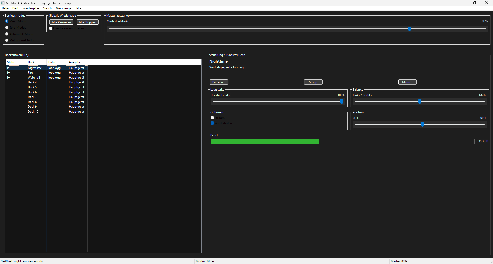

# MultiDeck Audio Player

MultiDeck Audio Player is an app that allows you to play multiple audio files or internet streams simultaneously. The player can be used to monitor multiple audio sources at the same time or to create complex soundscapes.

[](./multideck-screenshot.png)

# Contents

[TOC]

## Feature Overview

* **Independent audio decks**
    * Load local audio files (MP3, OGG, WAV, FLAC)
    * Stream from internet sources (Icecast/Shoutcast)
    * Monitor all sound card inputs (microphone, line-in)
    * FFmpeg should be installed on the system for playback support
    * **Individual controls for play/pause, volume, balance, mute, and loop**
    * Global play/pause control for all decks
    * Custom deck labels
    * Separate output device for each deck (multiroom mode only)
* **Four operating modes**
    * **Mixer mode**: All decks play simultaneously and overlap
    * **Solo mode**: Only one deck is audible at a time
    * **Automatic mode**: Automatically switches between decks, supports crossfade
    * **Multiroom mode**: Mixer mode with separate output devices for each deck
* **Project management**
    * Save and load complete deck configurations (.mdap files)
    * Import and export M3U playlists
* **Master output recorder**
    * Record audio output as WAV, MP3, OGG, or FLAC files
    * Real-time recording with status indicator and optional pre-roll buffer
* **Command-line interface**
    * Loads project files and plays them in server environments or on embedded systems
    * Optional silent mode for use in scripts

## Installation

**Note**: This guide covers only the pre-compiled program version. Installation and execution of the source code is described in detail in the project repository documentation.

### System Requirements

MultiDeck Audio Player was built and tested on Windows 11 and Debian Linux 13. Functionality on older operating systems cannot be guaranteed.

### Setup

The player can be started by launching the MultiDeck executable in the root directory (`MultiDeck.exe` on Windows, `./MultiDeck` on Linux). The program package includes a file called `config.ini.example`, which contains a sample configuration. To make MultiDeck fully portable, this file can be saved as `config.ini` in the program directory. Otherwise, the configuration is stored in the current user's application data folder, e.g. `%APPDATA%\MultiDeckAudioPlayer\` on Windows.

### Installing FFmpeg

To support additional audio formats, FFmpeg must be installed on the system, as the player will otherwise only be able to process WAV files.

#### Windows:

If WinGet is available on the system, the following command should be sufficient:

```
winget install Gyan.FFmpeg
```

To install FFmpeg manually:

1. Download the FFmpeg binaries, for example from https://www.gyan.dev/ffmpeg/builds/ (ffmpeg-release-essentials.zip is sufficient).
2. Extract the archive.
3. Copy `ffmpeg.exe` from the bin directory into the MultiDeck folder, or add the path to the bin directory to the Windows Path environment variable.

#### Linux and macOS:

FFmpeg is typically available through the system's package manager.

**Debian/Ubuntu**:

```bash
sudo apt update
sudo apt install ffmpeg
```

**Fedora**:

```bash
sudo dnf install ffmpeg
```

**macOS**:

```bash
brew install ffmpeg
```

## Program Layout

The program window largely follows a standard layout, consisting of a menu bar, a workspace, and a status bar. The menu bar contains all functions for controlling the program. The workspace holds the deck list, the global player controls for all decks, and the individual controls for the currently active deck. The status bar displays information about the active deck, the mixer mode, and the volume. The individual areas of the program are described in detail below.

### Menu Bar

#### File

* New Project (Ctrl+N): Creates an empty project.
* Open Project (Ctrl+O): Loads an existing project file (`*.mdap`) into the player.
* Save Project (Ctrl+S): Saves the settings of the current project.
* Save Project As (Ctrl+Shift+S): Saves the project under a different name.
* Import M3U Playlist (Ctrl+I): Imports an M3U playlist containing audio files or URLs and distributes them across the available decks. If no free decks are available, playlist entries will be ignored.
* Export M3U Playlist (Ctrl+E): Exports the files and URLs loaded in the decks as an M3U or M3U8 playlist.
* Recent Files: Contains a list of recently opened files. Note that these are the loaded audio files, not the project files. The list can be cleared if needed.
* Exit (Alt+F4): Exits the program.

#### Deck

* Load File (Ctrl+F): Loads an audio file into the selected deck.
* Load URL (Ctrl+U): Opens an internet stream in the selected deck.
* Load Sound Card Input (Ctrl+D): Enables playback of an audio source connected to the computer (microphone, line-in).
* Set intro file: Allows to select an intro audio file that will be played during deck switches.
* Clear intro file: Remove a previously selected intro audio file from the deck.
* Rename Deck (F2): Allows you to assign a custom name to the deck.
* Unload Deck (Del): Removes the file loaded on the selected deck.
* Start Deck Recording (Ctrl+Shift+R): Enables individual deck recording, independent of the selected operating mode.

#### Playback

* Play/Pause all Decks (Ctrl+P): Toggles playback on all loaded decks.
* Stop all decks (CTRL+Dot): Stops playback on all decks and resets time display.
* Play active deck (CTRL+Shift+P): Only starts the currently selected deck. 
* Stop active deck (CTRL+Shift+Dot): Stops playback on the selected deck.
* Toggle mute (Ctrl+M): Mute/unmute the active deck.
* Toggle loop (Ctrl+L): Loop playback for selected deck.
* Jump to time (Ctrl+J): Jump to a given time (Format: `HH:MM:SS`). 

#### View

* Status Bar (Ctrl+T): Toggles the display of the status bar.
* Level Meter: Enables or disables the display of the volume level in the current deck.
* Switch Theme (Ctrl+Shift+T): Switches the program interface between light and dark themes.

#### Tools

* Start/Stop Recording (Ctrl+R): Starts live recording of the output mixer. If no output directory has been set in the program options, the program will ask for a directory before starting the recording.
* Start/stop livestream (F8): Sends the mixer output to an Icecast server. Configure live streaming data in the program options first. 
* Audio Effects (Ctrl+Shift+E): Opens a window for configuring audio effects and VST plugins.
* Sleep timer (Ctrl+Shift+I): This allows you to stop the playback after a configured number of minutes and, optionally, shut down the computer.
* Options (Ctrl+Shift+O): Opens the program settings.

#### Help

* Documentation (F1): Opens this help file. If no help file is available, the program's website will be loaded instead.
* Open Website (Ctrl+F1): Opens the program's website.
* About: Contains brief information about the program.

### The Workspace

The left area of the window contains the operating mode selector, the global playback controls, and the deck list. These areas correspond to the master mix and the track list of a digital audio workstation (DAW). The right area contains the controls for the currently active deck.

#### Operating Modes

* Mixer mode (F3): All loaded decks play simultaneously and are audible at the same time.
* Solo mode (F4): Only the currently active deck is played back.
* Automatic mode (F5): Like solo mode, only the active deck is played, but the player switches between loaded decks at set time intervals.
* Multiroom mode: A special mixer mode which gives every deck the possibility to route its output to a different sound device, configurable in deck context menu.

#### Deck List

The deck list is used to select the active deck. To switch between decks, simply select one using the arrow keys or the mouse. The loaded content is displayed next to the deck name, along with status information and output device. 

#### Active Deck Controls

* Playback controls: Play/Pause and Stop
* Menu: Opens the context menu for the selected deck.
* Volume (Ctrl+Up/Down): Adjusts the volume of the active deck.
* Balance (Ctrl+Left/Right): Adjusts the balance of the active deck.
* Mute (Ctrl+M): Silences the deck.
* Loop (Ctrl+L): Enables or disables loop playback for local audio files.
* Position (Alt+Left/Right): Allows seeking within local audio files.
* Level: Provides a visual representation of the volume level along with the value in dB.

### Status Bar

The status bar is divided into 3 sections:

* First section (left): Contains information about the loaded project, the active deck, or the recording status, as well as the volume of the active deck. The display changes depending on the action being performed.
* Second section (center): Information about the selected operating mode (Mixer, Solo, or Automatic).
* Third section (right): Displays the current master volume.

## Program Options

The options can be accessed via the Tools menu or by pressing Ctrl+P. Individual settings pages can be selected using the category list. The "OK" button saves all settings and closes the preferences, while the "Apply" button saves only the settings of the current category and keeps the preferences opened. Some options may require a program restart, which will be indicated when saving.

### General

* Language: Sets the program language.
* Number of Decks: The number of decks shown in the main window.
* Theme: Sets the default appearance of the program.

### Audio

* Output Device: Displays the playback devices installed in the system. The host API used is shown next to the device name (MME, DirectSound, etc.).
* Buffer Size: Usually only needs to be adjusted when experiencing playback issues. The default value is 2048.
* Sample Rate: The sample rate to be used by the playback device.

### Automation

* Switch Interval (seconds): The time period after which the automation mode should switch to the next deck.
* Enable Crossfade: Enables a smooth transition between deck switches.
* Crossfade Duration: Duration of the crossfade in seconds.
* Enable Level-Based Switching: When this option is enabled, the automatic mode switches as soon as the volume level on a deck exceeds the threshold set below.
* Threshold (dB): The threshold value for automatic level-based switching.
* Hysteresis (dB): This value provides a tolerance margin to prevent quickly switching between decks. Calculation: threshold minus Hysteresis.
* Hold Time (seconds): After the level has decreased, this controls the minimum amount of time that must be spent on a deck before switching.

### Recording

* Format: The preferred audio format for recordings.
* Bit Rate (compressed formats only): The compression bit rate to use.
* Bit Depth (WAV only): The bit depth to use for WAV files.
* Pre-Roll Buffer (seconds): Allows the recording to be buffered in RAM for up to 2 minutes (120 seconds) before the actual recording starts. This buffered audio is prepended when recording begins.
* Output Directory: Sets the default folder for recordings.

### Streaming

* Server: the Icecast servers hostname without http.
* Port: Icecast server port.
* Mountpoint: Path to streaming mountpoint, starting with slash. 
* User credencials: Username and password separated by a colon.
* Codec: Streaming codec, MP3 or OGG Vorbis.
* Bitrate: Live stream quality.
* Stream name, description, genre and website URL: Stream meta data.
* Public stream: Tells the server to list the stream in public directories.
* Connect at startup: Connects the livestream when the program starts.
* Automatically Reconnect on Connection Loss: Rebuilds the stream if possible when the connection is interrupted.
* Reconnect Wait Time (seconds): The time to wait before attempting a new connection.

### Text-to-speech

* Enable text-to-speech announcements: Enables speaking keyboard-triggered status events, and deck announcement in automatic mode.
* Engine: TTS engine to use.
* Voice: TTS voice, depends on selected engine.
* Rate in percent, 0 for default.
* Volume in percent, -1 for engine default.

### Advanced configuration

Some special options are only available in the file `config.ini` located in the program's directory or in MultiDeck's application data. 

`[UI]`: 

* `deck_list_focus`: Controls whether MultiDeck should set the keyboard focus on the deck list when it starts (Default: True). 
* `force_dataview`: to ensure the best accessibility on all operating systems, MultiDeck uses a platform-specific control to display the deck list. This option forces the use of a DataView control to display the deck list if the operating system cannot be detected or if this is explicitly requested (default: False).
* `window_width` and `window_height`: Saves window sizes on exit and ususaly don't need to be set manually. 

Additional options in `[Streaming]` section:

* `queue_blocks`: The size of the internal audio buffer for the live stream. Although a higher value can improve stability in the event of streaming issues, it also increases latency (Default: 128).
* `writer_poll_ms`: This is how often the writer thread waits for new audio blocks. A lower value results in a more responsive behaviour, while a higher value results in slightly more lag (Default: 100).
* `ffmpeg_close_timeout`: How long to wait for FFmpeg to terminate (Default: 5.0).
* `ffmpeg_loglevel`: FFmpeg log level, e.g. quiet, error, warning, info. (Default: error).

`[Recent]`: 

* `max_recent_items`: Configures the maximum entries in recent files menu (Default: 10).

`[Logging]`: 

* `level`: The program's logging level, e.g. DEBUG, INFO, WARNING, ERROR, CRITICAL (Default: `INFO`).
* `file_logging`: Write log messages to file (Default: `True`)
* `console_logging`: Print terminal messages (Default: `False`). 

## Audio Effects

Some audio effects are available for the master mix or each deck individually, accessible via the Tools menu or with the keyboard shortcut Ctrl+Shift+E. First, select the desired deck or the master mix from the effect chain list. The effects are organized per deck across two pages: Built-in Effects and VST Plugins.

### Built-in Effects

* Enable Effects for Master/Deck: This option activates the respective effect chain and must also be enabled when using VST effects.
* Reverb: Adds more spatial depth to the audio. Parameters: Room size, damping, wet and dry level, width.
* Echo: Time, feedback, and mix are configurable.
* Equalizer: A simple three-band equalizer with bass, mid, and treble controls.
* Chorus: Contains parameters for rate, depth, and mix.
* Compressor: A simple dynamic compressor. Threshold, ratio, attack, and release time are configurable.
* Limiter: A limiter with integrated compressor; threshold and release time are configurable.
* Gain: Increases or reduces the volume from -24 to +24 dB.

### VST Plugins

VST plugins can be loaded on this page, either as single file or as folder bundle. They can be freely rearranged within the effect chain once loaded. Only VST3 effects are supported. The parameters of the selected plugin can be adjusted in the panel in the lower half of the screen. To open the plugin's native GUI, use the "Open Editor" button.

## Project Files

To avoid having to manually reload all decks every time the player is opened, MultiDeck Audio Player can save the deck and mixer configuration in project files ("*.mdap"). You can open these project files either in your preferred file manager or via the program's file menu. Some program settings can also be saved on a per-project basis and will be applied independently of the settings defined in the options when the project file is opened. The following settings are saved:

* Operating mode: Mixer, Solo, or Automatic
* Master volume
* Transition settings for automatic mode
* Deck contents: Name, loaded file/URL/sound input, multiroom device, volume/balance, mute, and loop
* Loaded effects with all parameters, if any

Changes in the mixer and the deck list are automatically detected by the player and indicated by an asterisk in the title bar as unsaved project changes. When closing the player, the program will ask whether the changes should be saved. The applied effects currently need to be saved manually, but triggering the save function from the File menu (Ctrl+S) is sufficient for this purpose.

## Further Reading

* [Source code on GitHub](https://github.com/schulle4u/multideck)
